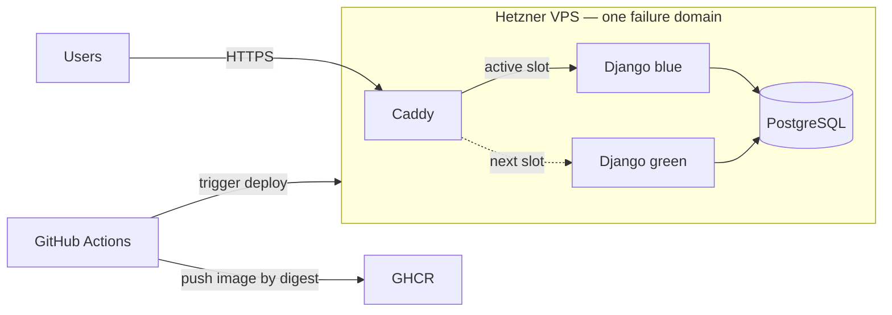

# Architecture Spine — Mawareeth Infrastructure Modernization

## Design Paradigm

**Single-node containerized modular monolith with blue-green edge switching.** Preserve the Django monolith, package it once as an immutable OCI image, and operate two interchangeable application slots behind a stable Caddy edge. PostgreSQL remains the single transactional state owner.



## Invariants & Rules

### AD-1 — Preserve the deployable monolith [ADOPTED]

- **Binds:** Application packaging and infrastructure boundaries
- **Prevents:** A Heroku exit turning into an unrelated frontend/backend rewrite
- **Rule:** The server-rendered Django application remains one deployable WSGI unit; infrastructure changes must not require Next.js, DRF extraction, or service decomposition. This spine governs the Heroku-exit phase and supersedes conflicting infrastructure-phase instructions in the older planning architecture; any later product rewrite requires a separately approved spine.

### AD-2 — One cost-first production host [ADOPTED]

- **Binds:** Production compute, database placement, and scaling
- **Prevents:** Premature multi-node cost and operational complexity
- **Rule:** Caddy, two interchangeable Django app slots, and PostgreSQL run through Docker Compose on one Hetzner VPS. Scale vertically when CPU exceeds 70% for 15 minutes under representative load, memory exceeds 80% for 15 minutes, swap/OOM occurs, or two-slot deployment headroom fails. Separate the database or add nodes when vertical scaling no longer clears those signals or externally measured monthly availability breaches the internal 99.9% objective. This is not a high-availability guarantee: the host, Docker daemon, Caddy, and PostgreSQL remain one failure domain.

### AD-3 — PostgreSQL exclusively owns durable application state [ADOPTED]

- **Binds:** Both app slots and all transactional writes
- **Prevents:** Slot-local state, split ownership, and deployment-dependent data loss
- **Rule:** Both app slots use the same private PostgreSQL service through `DATABASE_URL`; containers are disposable and may not own durable application data. Production uses one fixed Compose project name and a pre-provisioned `external: true` PostgreSQL volume with an explicit stable name. Preflight verifies the expected database identity/schema marker; app deploys may neither recreate the database service nor remove, rename, or replace its volume. PostgreSQL is never published publicly, and major-version changes require a separate rehearsed procedure.

### AD-4 — CI produces the only deployable artifact [ADOPTED]

- **Binds:** GitHub Actions, GHCR, and production deployment
- **Prevents:** Source builds on production, mutable releases, and host-only configuration drift
- **Rule:** GitHub Actions tests once, builds once, and publishes an immutable release manifest binding the app OCI digest, deployment-bundle commit, Compose/Caddy/deploy revisions, configuration-schema version, and migration contract. Production verifies the whole manifest and pulls only pinned artifacts, never branch heads or unmanaged host copies. Dependencies and base images are reproducibly locked; `collectstatic` and production-shaped `check --deploy` are hard gates; static assets remain image-owned and served by WhiteNoise through the active slot. The VPS does not host a CI runner, and secrets never enter artifacts.

### AD-5 — Every application release is blue-green [ADOPTED]

- **Binds:** Django app slots, health checks, Caddy, and rollback
- **Prevents:** Routine deployment downtime and replacing a healthy release with a broken one
- **Rule:** Deployment is a VPS-local crash-recoverable state machine under one exclusive lock. The persisted Caddy routing declaration is the sole active-slot authority. Reconcile routing, slot health, release identity, and image digest on every invocation; start the candidate; run the serialized compatible migration while the old slot remains live; verify candidate readiness against the post-migration schema; atomically replace and validate routing; reload Caddy; probe through production TLS for the expected release identity; then drain the old slot for up to 120 seconds and stop it. A crash at any transition must leave a known-good slot routable; any mismatch restores the prior route while that slot is still running.

### AD-6 — Database evolution is compatible across both slots [ADOPTED]

- **Binds:** Django migrations and blue-green releases
- **Prevents:** The new schema breaking the old slot during handover or rollback
- **Rule:** Commit migration files; CI runs `makemigrations --check --dry-run`; production never runs `makemigrations`. Serialize deploys and run one `migrate --noinput` job per release before traffic switches. Schema changes follow expand → migrate → contract; review SQL and lock behavior, bound lock waits, separate long backfills, and ship destructive contraction only after no deployed or rollback-eligible image depends on the old shape. Application rollback never automatically reverses schema migrations.

### AD-7 — Caddy is the sole public application edge [ADOPTED]

- **Binds:** TLS, public routing, and container exposure
- **Prevents:** Bypassed TLS, public app/database ports, and competing routing configuration
- **Rule:** Only Caddy accepts public HTTP/HTTPS traffic and owns certificates. Django and PostgreSQL remain on private Compose networks. Local private PostgreSQL uses an explicit non-TLS connection mode unless server TLS is deliberately configured; any future managed database requires verified TLS. Caddy changes use validated graceful reloads; production must fail closed with `DEBUG=False`, a required secret key, explicit hosts and trusted HTTPS origins, and trusted proxy/security settings rather than `ALLOWED_HOSTS = ['*']`.

### AD-8 — Minimum operations are part of every release

- **Binds:** Health, logging, and outage detection
- **Prevents:** Blind deployments, full disks from logs, and silent host failure
- **Rule:** Each app image exposes bounded liveness, readiness, and release-identity signals; readiness checks Django, database reachability, and the required schema contract without leaking diagnostics. Caddy switches only after retries succeed. Services log to stdout/stderr with bounded Docker rotation. External monitoring alerts the documented primary operator after two consecutive failed public probes; disk use alerts at 75% and becomes critical at 85%; the alert path is drill-tested before launch and quarterly. Gunicorn, Caddy, deployment, and Compose timeouts preserve in-flight requests up to the 120-second release bound; longer work must use the durable-job decision.

### AD-9 — Production cutover has safety gates

- **Binds:** Framework support, configuration security, and data durability
- **Prevents:** Launching on unsupported software or accepting unrecoverable user data
- **Rule:** Public production cutover requires Django 5.2 LTS, production settings that pass `manage.py check --deploy`, a tested off-host database backup/restore path, and a representative capacity test with PostgreSQL, Caddy, and both app slots running without swap/OOM or threshold breach. Infrastructure validation may precede these gates, but irreplaceable production data may not.

### AD-10 — Environments are isolated without a standing staging bill

- **Binds:** Development, CI, staging, production data, and secrets
- **Prevents:** Tests touching production and a permanently idle staging VPS
- **Rule:** Development uses local Compose; CI uses disposable services; staging is created on demand with isolated data and secrets and may not share production PostgreSQL. Production is the only continuously running remote environment in Phase 1.

### AD-11 — Business evidence is not operational telemetry

- **Binds:** Audit events, generated reports, verification uploads, and container logs
- **Prevents:** Legal/business records being lost through log rotation or ephemeral containers
- **Rule:** Domain audit events live durably in PostgreSQL, never only in container logs. Before enabling canonical PDFs or verification uploads, choose and protect either reproducible regeneration from immutable versioned inputs or durable object storage covered by backup/restore. In-process background threads are prohibited; asynchronous certified reports trigger a durable job/worker decision.

### AD-12 — Heroku exit is a separately rehearsed cutover

- **Binds:** Source database, configuration/add-ons, DNS, traffic, validation, and rollback
- **Prevents:** Split writes, stale data, and an irreversible DNS/database switch
- **Rule:** Before cutover, inventory Heroku configuration, add-ons, PostgreSQL version/extensions/locale/size, and DNS; lower TTL; restore a source-consistent logical dump into PostgreSQL 17.11 using target-version tools; run migrations and invariant/count checks; and measure duration in rehearsal. The approved runbook must choose write freeze or replication, define user-visible behavior, and name the last safe rollback point. Source data directories are never reused across PostgreSQL majors. Routine zero-downtime release guarantees begin only after this one-time cutover succeeds.

### AD-13 — The sole host has a reproducible security baseline

- **Binds:** Region, operating system, administrative access, firewall, Docker, patching, and secrets
- **Prevents:** Pet-server drift and one-host compromise bypassing every container boundary
- **Rule:** Phase 1 provisions Hetzner `nbg1` (Nuremberg) with Ubuntu 24.04 LTS through an idempotent bootstrap script or version-controlled checklist. Use a default-deny firewall with only 80/443 public and restricted key-only SSH, install Docker Engine from Docker's official stable repository, apply security patches on a documented maintenance cadence, and keep runtime secrets in a root-owned non-repository file with restrictive permissions and redaction from CI/logs.

## Consistency Conventions

| Concern | Convention |
| --- | --- |
| Release identity | Git commit SHA for human traceability; OCI digest for deployment identity |
| Runtime slots | `blue` and `green`; exactly one is active at the Caddy edge |
| Configuration | Immutable schema/version in the release manifest; one hashed runtime snapshot shared by both slots; standard `DATABASE_URL` |
| Secret rotation | Separate phased operation; compatibility-affecting keys use dual-read/dual-key overlap and are not rotated inside an ordinary release |
| State mutation | Django ORM and committed migrations are the only schema/data mutation path |
| Dates and logs | UTC timestamps; structured application logs to stdout/stderr |
| Failure behavior | Health/reload failure preserves the active slot; rollback selects the previous immutable digest |
| Environment isolation | Local development, disposable CI, on-demand isolated staging, continuously running production |
| Audit evidence | Domain records in PostgreSQL; operational logs are non-authoritative and may rotate |

## Stack

| Name | Version |
| --- | --- |
| Python | 3.12.14 target, with base image pinned by digest |
| Django | 5.2.17 LTS target; current brownfield constraint is `>=4.2,<5.0` and must be upgraded before public cutover |
| Gunicorn | 26.2.0 target, subject to test-suite and graceful-drain smoke gate |
| PostgreSQL | 17.11 target, pinned by image digest |
| Caddy | 2.11.4, pinned by image digest |
| Docker Engine | 29.7.2 from Docker stable repository; security patches within major 29 |
| Docker Compose plugin | 5.5.0; Compose Specification |
| Container registry | GitHub Container Registry; deploy by immutable digest |

## Structural Seed

```text
deploy/
  compose.yaml          # Caddy, PostgreSQL, and blue/green app slots
  Caddyfile             # stable edge plus generated active-slot import
  active-slot.caddy     # atomic, authoritative blue/green selection
  deploy.sh             # pull, start, migrate, health, switch, drain
  bootstrap.sh          # reproducible host baseline
  release-manifest.json # immutable app, deployment, config, schema identities
.github/workflows/
  ci.yaml               # tests
  deploy.yaml           # build, publish, and invoke production deploy
```

## Capability → Architecture Map

| Capability / Area | Lives in | Governed by |
| --- | --- | --- |
| Existing web application | Django/Gunicorn image | AD-1, AD-4 |
| Public HTTPS and routing | Caddy | AD-5, AD-7 |
| Transactional persistence | PostgreSQL volume and private network | AD-3, AD-6 |
| Build and release | GitHub Actions + GHCR | AD-4 |
| Zero-downtime deployment | Blue/green slots + `deploy.sh` | AD-5, AD-6 |
| Runtime configuration | Compose environment and VPS secret store | AD-4, conventions |
| Health and diagnostics | Django health endpoint, external probe, container logs | AD-8 |
| Production readiness | Framework and restore gates | AD-9 |
| Environment separation | Local Compose, CI services, on-demand staging, production VPS | AD-10 |
| Audit and durable artifacts | PostgreSQL plus a future artifact policy | AD-11 |
| Heroku data and DNS cutover | Rehearsed migration runbook | AD-12 |
| Host provisioning and security | Versioned bootstrap/checklist | AD-13 |

## Deferred

- Continuous WAL archiving and point-in-time recovery; revisit immediately after the first tested off-host backup/restore path exists.
- Multi-host high availability; revisit when host maintenance/failure downtime becomes unacceptable.
- Managed PostgreSQL such as Neon; revisit when database operations, memory pressure, or availability justify its recurring cost.
- Vercel or a separate Next.js frontend; revisit only if a product requirement creates an independently deployable frontend.
- Redis, task workers, Kubernetes, and a self-hosted PaaS dashboard; revisit only when measured workload or team operations require them.
- Object storage/CDN for user media; revisit before introducing durable user uploads or when static delivery becomes a bottleneck.
- Saudi/Middle East data residency; resolve before any policy or customer contract makes regional placement mandatory.
- AES-256 data-at-rest requirement; Hetzner documents at-rest encryption as the client's responsibility, so validate the requirement and choose host-, field-, or artifact-level encryption before storing sensitive verification documents. Future off-host backups must be client-side encrypted.
- Durable asynchronous report workers; revisit before enabling certified reports that cannot complete safely within a bounded web request.
