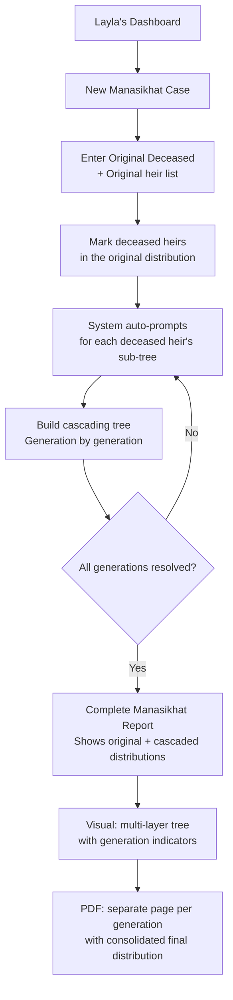

# UX Design Specification - Mawareeth V3

**Author:** Ahmad
**Date:** 2026-03-03

---

## Executive Summary

### Project Vision

Mawareeth V3 is the definitive universal protocol for Islamic inheritance — a platform that bridges 1,400 years of jurisprudence with modern legal technology. It serves heirs, lawyers, and courts in Lebanon and the global diaspora by replacing fragmented, error-prone manual methods with a deterministic, scholarly-validated engine. The core innovation is a "Modular Madhab" architecture with a recursive Manasikhat graph-solver for multi-generational cascades.

### Target Users

**Primary Personas:**

1. **The Diaspora Heir (Sami)** — Non-expert living abroad dealing with a deceased relative's estate. Emotionally invested, needs clarity and trust. Expects a guided experience that explains complex Islamic inheritance rules in plain language. Success = resolving family conflict with a clear, printable report in <5 minutes.

2. **The Estate Lawyer (Layla)** — Professional handling 10+ inheritance cases monthly. Power user who needs speed, accuracy, and court-ready output. Values automation of complex multi-generational cascades. Success = 5+ hours saved per case with 'Mawareeth-Certified' reports attached to court filings.

3. **The Court Clerk (Mustafa)** — Institutional user processing official 'Hasr al-Irth' decrees. Receives pre-prepared reports and needs standardized, verifiable documentation with fiqh citations. Success = expedited judicial approval through trusted, citation-backed reports.

### Key Design Challenges

1. **Complexity vs. Simplicity** — Serving non-expert heirs and professional lawyers through the same interface without overwhelming one or constraining the other.
2. **Bilingual RTL/LTR Typography** — Arabic (RTL), English, and French across the UI and court-formatted PDF reports with precise legal terminology.
3. **Trust & Authority Perception** — Every design decision must reinforce scholarly credibility; users make life-altering financial decisions based on this tool.
4. **Complex Data Input** — Multi-generational family tree construction through conversational Guided Interview that feels intuitive, not bureaucratic.
5. **Mobile-First on Constrained Networks** — Optimized for 3G/4G Lebanese networks with snappy interview flows and real-time calculation previews.

### Design Opportunities

1. **"Silent Authority" Design Language** — A visual identity merging modern legal document aesthetics with scholarly gravitas — clean Bento Grid layouts, precise typography, and fiqh citation callouts.
2. **Progressive Disclosure** — Guided Interview that unfolds complexity naturally; non-experts see simplicity while lawyers access advanced capabilities through the same engine.
3. **Visual Family Tree as Trust Builder** — Real-time kinship graph visualization during data input that builds user confidence and serves as the emotional anchor of the experience.

## Core User Experience

### Defining Experience

The core experience of Mawareeth V3 is **clarity through simplicity**. The product transforms a process that traditionally requires scholarly expertise, legal consultation, and months of court proceedings into an immediately understandable, self-service flow. The Guided Interview is the product — every interaction serves the goal of making complex Islamic inheritance law feel approachable, transparent, and resolved.

The defining user action is the complete journey from "someone has passed away" to "I have everything I need for court" — not just a calculation, but a full relief package that eliminates the painful, drawn-out inheritance process.

### Platform Strategy

**Dual-Context Design:**

- **Desktop-First for Professionals** — Lawyers (Layla) and court clerks (Mustafa) work at desks, often with multiple cases. Desktop experience optimized for efficiency, multi-case management, and detailed report review.
- **Mobile-First for Heirs** — Diaspora heirs (Sami) access primarily via mobile browsers. Interview flow must be thumb-friendly, performant on 3G/4G, and feel complete without a desktop.
- **Responsive Bridge** — Core Guided Interview works flawlessly across both contexts. Professional features (batch cases, detailed audit views) surface on desktop; streamlined single-case flow on mobile.
- **Technology:** Next.js SPA/SSG — SPA for interactive interviews, SSG for SEO keyword landing pages targeting #1 global search ranking.

### Effortless Interactions

**What must feel invisible:**

1. **Sign-up & Authentication** — Zero friction to start calculating. Account creation only required when saving/sharing results. Optional login with no barriers to the core experience.
2. **Save & Retrieve** — One-tap save. Reports persist and are instantly retrievable across devices.
3. **Print & Share** — Court-ready PDF generation feels instant. Share via link, WhatsApp, or email with one action. Reports formatted to Lebanese 'Hasr al-Irth' standards without user configuration.
4. **Validation & Certification** — Clear pathway from "Preliminary" to "Certified" status. Lawyer verification flow is streamlined — review, certify, done.
5. **Madhab-Specific Adjustments** — Rules adapt automatically based on selected school of jurisprudence. Users never manually configure legal logic.

### Critical Success Moments

1. **The Relief Moment** — User realizes they have a complete, court-ready package that replaces months of manual process. This is the emotional peak — not a number, but liberation from bureaucratic burden.
2. **First Share** — When Sami sends the PDF to his siblings in Beirut and the family tension begins to dissolve because there's now a clear, authoritative answer.
3. **Lawyer Adoption** — When Layla attaches a 'Mawareeth-Certified' report to a court filing for the first time and it's accepted — establishing the platform as the "Silent Advocate."
4. **Tree Recognition** — The moment during the Guided Interview when the visual family tree reflects the user's actual family — "it understands my situation."

### Experience Principles

1. **Clarity Above All** — Every screen, every label, every interaction must make complex inheritance law feel simple and understandable. When in doubt, simplify.
2. **Full Package, Not Just Math** — The product delivers relief, not calculations. Every feature serves the goal of replacing the court marathon with a complete, ready-to-submit package.
3. **Trust Through Transparency** — Show the reasoning. Cite the fiqh. Display the math. Users trust what they can verify — especially in matters of religious law and family wealth.
4. **Zero Friction to Value** — No sign-up to calculate. No configuration to get started. The first meaningful result should arrive within 60 seconds of landing.

## Desired Emotional Response

### Primary Emotional Goals

The three emotional pillars of Mawareeth V3:

1. **Trust** — Users must feel absolute confidence that the calculations are correct, scholarly-validated, and aligned with their specific school of Islamic jurisprudence. Trust is earned through transparency (showing the math, citing the fiqh) and reinforced through visual authority (clean, precise, professional design).

2. **Value** — Users should feel the tangible worth of what Mawareeth delivers. The experience must communicate: "This would have cost you months of court visits, thousands in legal fees, and countless family arguments." The savings in time, effort, and money should be felt, not just calculated.

3. **Ease** — Complex Islamic inheritance law should feel approachable and navigable. Users should never feel lost, confused, or overwhelmed. Every interaction should feel like having a calm, knowledgeable guide walking beside them.

### Emotional Journey Mapping

| Stage | Desired Emotion | Design Implication |
|-------|----------------|-------------------|
| **Discovery** (landing page) | Curiosity + Recognition — "This is exactly what I've been looking for" | Clear value proposition, authoritative but welcoming tone, immediate credibility signals |
| **First Interaction** (starting the interview) | Ease + Confidence — "I can do this" | Simple first question, no sign-up wall, progressive disclosure |
| **During Interview** (building family tree) | Guided + Engaged — "It understands my family" | Visual family tree growing in real-time, gentle validation, contextual help |
| **Viewing Results** | Relief + Trust — "This is correct and complete" | Clear share breakdown, fiqh citations visible, mathematical proof accessible |
| **Generating Report** | Value + Empowerment — "I have everything I need" | Court-ready PDF, professional formatting, certification pathway clear |
| **Sharing with Family** | Resolution + Peace — "We can finally agree" | Easy share actions, authoritative presentation that settles disputes |
| **Error/Invalid Input** | Guided + Respected — "I'm being helped, not judged" | Gentle redirection with Islamic legal explanation, suggested corrections, never a dead end |
| **Returning User** | Familiarity + Efficiency — "Right where I left off" | Saved state, quick resume, case history |

### Micro-Emotions

**Critical Emotional States to Cultivate:**
- **Confidence over Confusion** — Every label, every step must be crystal clear. When users encounter Islamic legal terminology, contextual explanations appear naturally.
- **Trust over Skepticism** — Fiqh citations and mathematical proofs are always one tap away. The system shows its work, never asking for blind faith.
- **Accomplishment over Frustration** — Progress indicators, celebration of completed steps, and clear "you're done" moments.
- **Reverence over Casualness** — The interface honors the sacred nature of Sharia law. Design choices reflect the gravity and precision of divine jurisprudence.

**Emotions to Actively Prevent:**
- **Overwhelm** — Never show full complexity upfront; progressive disclosure at every level.
- **Doubt** — Never leave users wondering "is this right?" — cite sources, show reasoning.
- **Abandonment** — Never let users hit a dead end; always provide a path forward.
- **Disrespect** — Never trivialize the religious, legal, or emotional weight of inheritance.

### Design Implications

| Emotional Goal | UX Design Approach |
|---------------|-------------------|
| **Trust** | Scholarly citations visible on every result; "Mawareeth-Certified" badge system; transparent calculation methodology; clean, authoritative typography |
| **Value** | Implicit communication of time/money saved; comparison to traditional process; professional output quality that replaces paid services |
| **Ease** | One question at a time in interview flow; thumb-friendly mobile targets; contextual tooltips for legal terms; minimal cognitive load per screen |
| **Sacred Seriousness** | Restrained color palette honoring Sharia context; precise Arabic typography; no playful animations or casual language; design language inspired by scholarly Islamic texts |
| **Guided Recovery** | Errors explained with Islamic legal reasoning; suggested corrections; "this isn't possible because..." with fiqh references; never a raw error message |

### Emotional Design Principles

1. **Honor the Weight** — This is Sharia law, family wealth, and often grief. The design must reflect the sacred seriousness of the domain — precise, reverent, and dignified. Not somber, but never casual.
2. **Show, Don't Ask to Trust** — Every calculation shows its source. Every result cites its fiqh. Every share displays its mathematical proof. Trust is demonstrated, not requested.
3. **Guide Like a Scholar** — When users encounter complexity or errors, respond with the patience and clarity of a knowledgeable teacher. Explain the "why" from Islamic jurisprudence, not just the "what."
4. **Make the Value Tangible** — Users should feel the weight of what they've received — a court-ready package that replaces months of manual process. The output quality itself communicates value.

## UX Pattern Analysis & Inspiration

### Inspiring Products Analysis

**1. WhatsApp — The Sharing & Accessibility Benchmark**
- **Why it matters:** The primary communication tool across Lebanon and the diaspora. Users of all ages and tech levels are fluent in WhatsApp.
- **Key UX strengths:** Zero-friction sharing (one tap to send to anyone), universal accessibility (grandmother-friendly), trust signals (end-to-end encryption messaging), instant delivery confirmation.
- **Lesson for Mawareeth:** Report sharing must feel as natural as sending a WhatsApp message. One tap to share via WhatsApp, link, or email. The sharing flow should leverage WhatsApp as a primary distribution channel.

**2. Instagram — The Visual Storytelling Benchmark**
- **Why it matters:** Demonstrates how complex content (photos, videos, stories, reels) can be presented through progressive disclosure without overwhelming users.
- **Key UX strengths:** Visual-first content hierarchy, buttery-smooth interactions even on constrained networks, progressive complexity (feed → tap → swipe → explore), elegant handling of multimedia.
- **Lesson for Mawareeth:** The family tree visualization should tell the story before the numbers do. Users should *see* their family structure emerge visually, with calculation details revealed progressively. Interactions must feel polished and lag-free, even on Lebanese 3G/4G.

**3. Banking Apps — The Trust & Authority Benchmark**
- **Why it matters:** Users trust banking apps with their money — the highest-stakes digital interaction most people have. Mawareeth handles family wealth distribution under divine law — stakes are equally high.
- **Key UX strengths:** Authority through visual restraint, clear transaction audit trails, security signals at every step (biometrics, encryption badges, confirmation flows), professional output (statements, receipts).
- **Lesson for Mawareeth:** The "Mawareeth-Certified" badge must carry the same weight as a bank's security seal. Calculation audit trails should feel like transaction histories — traceable, verifiable, trustworthy. The entire visual language should communicate institutional-grade reliability.

**4. TurboTax — The Guided Interview Benchmark**
- **Why it matters:** Successfully guides non-experts through complex tax law via conversational, step-by-step interview — directly analogous to Islamic inheritance law complexity.
- **Key UX strengths:** One question at a time, contextual help tooltips, real-time calculation previews, progress indicators, smart branching based on answers, professional output (tax returns).
- **Lesson for Mawareeth:** The Guided Interview should follow TurboTax's proven pattern — one question per screen, dynamic branching based on Madhab selection, real-time share previews as heirs are added, and a clear progress indicator showing how close users are to their complete report.

### Transferable UX Patterns

**Navigation & Flow Patterns:**
- **WhatsApp-style sharing flow** — One-tap share to WhatsApp, link copy, or email directly from the results screen. Share preview shows a professional card with case summary.
- **TurboTax-style guided interview** — Sequential question flow with smart branching. Each screen asks one thing. Back button always available. Progress bar shows completion.
- **Instagram-style progressive disclosure** — Summary view first (family tree + shares), tap to expand details (fiqh citations, mathematical proofs), deep dive available but never forced.

**Trust & Authority Patterns:**
- **Banking-grade security signals** — "Mawareeth-Certified" badge with visual weight equivalent to a bank's security seal. Encryption indicators for sensitive data. Verification status prominently displayed.
- **Banking-style audit trail** — Every calculation step logged and viewable. Transparent methodology accessible at any point. Version history for modified cases.

**Visual & Interaction Patterns:**
- **Instagram-smooth transitions** — Polished micro-interactions, smooth page transitions, skeleton loading states. No jank, no layout shift. Performance-optimized for constrained networks.
- **Banking-clean layouts** — Restrained, professional visual design. Generous whitespace. Typography-driven hierarchy. Every element earns its place on screen.

### Anti-Patterns to Avoid

1. **"Islamic website" aesthetic** — Ornate borders, green-and-gold everything, mosque clipart, decorative Arabic calligraphy as UI chrome. This undermines professional credibility and feels dated. Mawareeth should look like a fintech product, not a religious website.
2. **Calculator-dump results** — Showing raw numbers in a grid without context or explanation. Every competing inheritance calculator does this. Mawareeth must show results as a *story* — who gets what, why, and what to do next.
3. **Registration wall before value** — Forcing sign-up before users can calculate. This kills conversion. Users must experience the full calculation before being asked to create an account.
4. **Desktop-only PDF design** — Generating reports that look terrible on mobile screens. Reports must be responsive or mobile-optimized alongside the traditional court-format PDF.
5. **Technical jargon without context** — Displaying terms like "Asaba" or "Fard" without inline explanation. Every Islamic legal term needs a contextual tooltip or plain-language companion.

### Design Inspiration Strategy

**Adopt Directly:**
- WhatsApp sharing mechanics (one-tap share, WhatsApp as primary channel)
- TurboTax guided interview pattern (one question/screen, smart branching, progress bar)
- Banking trust signals (certification badges, audit trails, professional output)

**Adapt for Mawareeth:**
- Instagram's visual storytelling → Family tree as visual narrative that builds in real-time
- Banking app restraint → "Sacred seriousness" design language honoring Sharia context
- TurboTax's contextual help → Fiqh-aware tooltips explaining Islamic legal reasoning

**Actively Avoid:**
- Ornate "Islamic website" aesthetics — use modern, clean fintech visual language instead
- Calculator-dump result screens — tell the inheritance story, don't just show numbers
- Registration walls before calculation — zero friction to first result
- Desktop-only thinking — dual-context design (mobile heirs, desktop professionals)

## Design System Foundation

### Design System Choice

**Stack:** Next.js 14+ App Router + shadcn/ui + Tailwind CSS + React Hook Form + Zod

**Why shadcn/ui:**
- Built on Radix UI primitives with native RTL and WCAG accessibility support
- Tailwind-based theming aligns with "Trust & Authority" style from UI UX Pro Max
- Components are copied into the project (not imported from node_modules), giving full control for Mawareeth-specific customization
- React Hook Form + Zod integration provides type-safe, performant form handling — critical for the Guided Interview engine
- Follows `cn()` and `cva` patterns for consistent custom component development

### Rationale for Selection

| Requirement | How shadcn/ui Delivers |
|------------|----------------------|
| **Sacred seriousness** | Restrained, typography-driven design; no opinionated visual decoration |
| **RTL/Bilingual** | Radix primitives support RTL natively; Tailwind logical properties (`ms-`, `me-`) for automatic layout mirroring |
| **WCAG 2.1 AA** | Built-in ARIA labels, keyboard navigation, focus management, color contrast compliance |
| **Guided Interview** | Form + FormField + FormMessage pattern with React Hook Form provides step-by-step interview architecture |
| **Solo developer** | Copy-paste components with full ownership; no dependency lock-in; strong community and documentation |
| **Performance** | Tree-shakeable, minimal bundle; SSG-compatible for SEO landing pages |

### Implementation Approach

**Design Tokens (Tailwind + CSS Variables):**

```css
/* Mawareeth V3 Design Tokens */
--primary: #1E3A8A;        /* Authority Navy */
--primary-foreground: #FFFFFF;
--secondary: #1E40AF;      /* Deep Blue */
--accent: #B45309;         /* Trust Gold/Amber */
--background: #F8FAFC;     /* Clean Slate */
--foreground: #0F172A;     /* Near-Black Text */
--muted: #64748B;          /* Slate-500 for secondary text */
--border: #E2E8F0;         /* Slate-200 for borders */
--destructive: #DC2626;    /* Error Red */
--success: #16A34A;        /* Validation Green */
```

**Typography System:**

| Context | Font | Weights | Usage |
|---------|------|---------|-------|
| **English/French Headings** | Lexend | 500, 600, 700 | H1-H4, navigation, buttons |
| **English/French Body** | Source Sans 3 | 300, 400, 500 | Body text, form labels, descriptions |
| **Arabic Headings & Body** | Noto Sans Arabic | 400, 500, 600, 700 | All Arabic text — headings and body |
| **Monospace (Math Proofs)** | JetBrains Mono | 400, 500 | Calculation proofs, share fractions |

**RTL Implementation Strategy:**
- Set `dir` attribute dynamically based on selected language (`dir="rtl"` for Arabic, `dir="ltr"` for English/French)
- Use Tailwind logical properties exclusively: `ms-4` (margin-start) not `ml-4` (margin-left)
- Tailwind `rtl:` variant for RTL-specific overrides where logical properties aren't sufficient
- shadcn/ui Radix components handle RTL focus management, dropdown positioning, and dialog layout automatically
- Test every component in both directions during development

### Customization Strategy

**shadcn/ui Base Components (Install via CLI):**
- Button, Card, Dialog, Form, Input, Select, Tabs, Tooltip, Badge, Progress, Separator, Sheet, Skeleton, Toast

**Custom Mawareeth Components (Built following shadcn patterns with `cn()` + `cva`):**

| Component | Purpose | Complexity |
|-----------|---------|-----------|
| **HeirAdder** | Interactive component for adding/removing heirs with type selection, relationship validation, and dynamic form fields based on Madhab rules | High — Core custom component |
| **FamilyTreeVisualizer** | Real-time SVG/Canvas kinship graph that grows as heirs are added during the Guided Interview | High — Emotional anchor of the experience |
| **InterviewStepper** | Multi-step wizard engine powering the Guided Interview with smart branching, progress tracking, and back navigation | High — Product-defining flow |
| **ShareResultCard** | Displays individual heir's share with fraction, percentage, fiqh citation, and expandable mathematical proof | Medium — Trust-building pattern |
| **FiqhCitationTooltip** | Contextual tooltip displaying Islamic legal source, Madhab, and plain-language explanation | Medium — Transparency pattern |
| **CertificationBadge** | Visual badge displaying "Preliminary" or "Mawareeth-Certified" status with verification details | Low — Trust signal |
| **MadhabSelector** | School of jurisprudence selection with brief explanation of each option | Low — Interview entry point |

**Component Development Rules:**
- All custom components follow shadcn conventions: `cn()` for className merging, `cva` for variants
- Every component supports `dir="rtl"` and `dir="ltr"` — test both during development
- Form components integrate with React Hook Form via `FormField` + `FormControl` pattern
- Validation schemas defined in Zod with bilingual error messages
- All interactive elements include `cursor-pointer`, visible focus states, and smooth transitions (150-300ms)

## Defining Core Experience

### The Defining Experience

**One-sentence description:** *"Tell it who passed away and who's in the family — it gives you the complete inheritance shares with the Islamic legal proof, ready for the lawyer and the court."*

Mawareeth V3's defining experience is **preparation that eliminates confusion**. In the Lebanese inheritance process (حصر الإرث), Step 4 — obtaining the court's "Hujjat Hasr Irth" that determines heirs and their legal shares — is the most complex, expensive, and scholar-dependent step. Mawareeth automates this exact step, producing a court-formatted report with fiqh citations that the lawyer can use directly in the filing.

The product is the **preparation layer** that makes every downstream step (lawyer filing, court review, property transfer) faster, cheaper, and conflict-free.

### User Mental Model

**How the problem is currently solved (Lebanon):**

The Lebanese inheritance process (حصر الإرث) involves 6 sequential bureaucratic steps:

1. **Death Certificate** (شهادة الوفاة) — Obtained from the Mukhtar (village head)
2. **Family Registry Extract** (إخراج قيد عائلي) — Shows the deceased struck off the register
3. **Mukhtar's Attestation** (إفادة المختار) — Lists date of death, heir names, and addresses
4. **Court Application for Hasr al-Irth** (حجة حصر إرث) — Filed at the Sharia Court (Muslims) or Ecclesiastical Court (Christians) to legally determine heirs and their shares
5. **Financial Declaration** (تصريح عن التركة) — All assets (real estate, bank accounts, vehicles) declared to the Ministry of Finance within 90 days of death
6. **Property Transfer** (نقل الملكية) — After paying transfer fees, ownership moves to heirs' names at real estate registry and vehicle registration

**Required Documents:** Death certificate, family registry extract (إخراج قيد عائلي), individual registry extracts for each heir (إخراجات قيد أفرادي), Mukhtar's attestation, property deeds/vehicle registrations, and the Hasr al-Irth application (prepared by a lawyer).

**Note:** If there is a legal dispute, the 90-day deadline for financial declaration starts from the date of the final court ruling, not the date of death.

**What Mawareeth replaces:** Step 4 is where families get stuck. Determining who inherits what share under which school of Islamic jurisprudence requires scholarly expertise. Families hire lawyers, consult scholars, and wait months — all while tensions build. Mawareeth produces the answer to Step 4 in minutes, with the legal citations to back it up.

**User's mental model:** "I need to figure out who gets what *before* going to the lawyer." Mawareeth is the preparation step that gives heirs clarity and gives lawyers a verified foundation.

### Success Criteria

| Criterion | Measurement | Target |
|-----------|------------|--------|
| **Speed to clarity** | Time from first click to seeing complete share distribution | < 5 minutes for 3-generation cases |
| **Court-readiness** | Report formatted to Lebanese Hasr al-Irth standards with fiqh citations | 100% of reports meet standard |
| **Self-service completion** | Non-expert heirs can complete the interview without external help | 90%+ unaided completion rate |
| **Lawyer acceptance** | Lawyers can use the report as foundation for court filing | Report accepted by legal professionals |
| **Family resolution** | Multiple family members see the same authoritative answer | Shareable, unambiguous results |

**Users say "this just works" when:**
- The family tree they built matches their actual family
- The share distribution includes the *why* (fiqh citation), not just the *what* (percentage)
- The PDF looks like something a lawyer would produce, not a calculator printout
- They can share it with siblings and everyone sees the same clear answer

### Novel UX Patterns

**Pattern Analysis: Established foundations with domain-specific innovation**

**Established Patterns (users already understand):**
- Multi-step form wizard (TurboTax model) — familiar and proven
- PDF report generation — expected output format
- Share via link/WhatsApp — second nature for the target audience

**Novel Innovation (unique to Mawareeth):**
- **Fiqh-Aware Progressive Disclosure** — Legal reasoning revealed contextually, not dumped. Each share shows its Islamic legal basis on demand. This pattern doesn't exist in any competing calculator.
- **Real-Time Family Tree as Trust Anchor** — The visual kinship graph builds as users add heirs, confirming "the system understands my family" before any calculation happens. This is the emotional bridge between data entry and trust in results.
- **Court-Ready Output from Consumer Input** — Consumer-grade interview simplicity producing professional-grade legal documentation. The gap between input effort and output quality is the "magic moment."

**Teaching Strategy for Novel Patterns:**
- Family tree visualization needs no teaching — it's intuitive (users see their family appear)
- Fiqh citations use progressive disclosure — summary visible, detail on tap
- Court formatting is invisible to users — they just see "professional PDF"

### Experience Mechanics

**1. Initiation — "Start Your Inheritance Case"**
- Landing page communicates value: "Get your inheritance shares in minutes, backed by Islamic law"
- Single CTA button: "Start Calculation" — no sign-up required
- First screen: "Select your school of jurisprudence" (MadhabSelector component)

**2. Interaction — The Guided Interview**
- **Step A: Deceased Information** — Name, gender, date (minimal fields)
- **Step B: "Who are the heirs?"** — HeirAdder component, one heir at a time
  - Select relationship type (son, daughter, wife, father, mother, etc.)
  - System validates against Madhab rules in real-time
  - Family tree visualizer updates with each addition
  - Running share preview updates dynamically
- **Step C: Review Family Tree** — "Is this your complete family?"
- **Step D: Confirm and Calculate** — Final review before calculation

**3. Feedback — Real-Time Trust Building**
- Family tree grows visually with each heir added (FamilyTreeVisualizer)
- Share percentages preview updates in real-time (sidebar/bottom panel)
- Validation messages explain *why* in Islamic legal terms (FiqhCitationTooltip)
- Progress bar shows interview completion

**4. Completion — The Relief Moment**
- Full results screen: family tree + share breakdown + fiqh citations
- "Download Court-Ready PDF" — prominent CTA
- "Share with Family" — WhatsApp, link, email (one tap)
- "Save This Case" — triggers optional account creation
- Clear next steps: "Take this to your lawyer for the Hasr al-Irth filing"

## Visual Design Foundation

### Color System

**Primary Palette — "Sacred Authority"**

The Mawareeth V3 color system draws from two traditions: the restrained authority of legal/financial institutions and the dignified warmth of Islamic scholarly tradition. No ornamental "Islamic green" — instead, a navy-and-amber palette that communicates institutional trust.

| Token | Value | Usage | Contrast on White |
|-------|-------|-------|-------------------|
| `--primary` | `#1E3A8A` (Authority Navy) | Primary buttons, headings, nav active states | 9.6:1 (AAA) |
| `--primary-foreground` | `#FFFFFF` | Text on primary backgrounds | — |
| `--secondary` | `#1E40AF` (Deep Blue) | Secondary actions, links, selected states | 7.2:1 (AAA) |
| `--accent` | `#B45309` (Trust Amber) | CTAs, highlights, certification badges, fiqh citation markers | 4.8:1 (AA) |
| `--background` | `#F8FAFC` (Clean Slate) | Page backgrounds | — |
| `--foreground` | `#0F172A` (Near-Black) | Primary body text | 16.1:1 (AAA) |
| `--muted` | `#64748B` (Slate-500) | Secondary text, placeholders, labels | 4.6:1 (AA) |
| `--muted-foreground` | `#94A3B8` (Slate-400) | Disabled states, metadata | 3.1:1 (decorative only) |
| `--border` | `#E2E8F0` (Slate-200) | Card borders, dividers, input borders | — |
| `--card` | `#FFFFFF` | Card backgrounds, elevated surfaces | — |
| `--destructive` | `#DC2626` (Red-600) | Error states, invalid inputs, warnings | 5.1:1 (AA) |
| `--success` | `#16A34A` (Green-600) | Valid states, completed steps, checkmarks | 4.5:1 (AA) |
| `--info` | `#0284C7` (Sky-600) | Informational tooltips, fiqh citation backgrounds | 4.5:1 (AA) |

**Semantic Color Usage:**
- **Navy (#1E3A8A)** = Authority, institution, primary actions
- **Amber (#B45309)** = Warmth, certification, attention, scholarly tradition
- **Slate scale** = Content hierarchy, from foreground (#0F172A) to borders (#E2E8F0)
- **No green as primary** — deliberately avoiding "Islamic website" green cliché. Green used only semantically for success/valid states.

**Dark Mode (Phase 2):**
- Not in MVP scope, but color system designed with CSS variables for easy future dark mode implementation
- All tokens defined as HSL values in `:root` and overridden in `.dark` class

### Typography System

**Type Scale (8px base unit, 1.25 ratio):**

| Level | Size | Weight | Line Height | Usage |
|-------|------|--------|-------------|-------|
| `display` | 48px / 3rem | 700 | 1.1 | Landing page hero |
| `h1` | 36px / 2.25rem | 700 | 1.2 | Page titles |
| `h2` | 28px / 1.75rem | 600 | 1.3 | Section headings |
| `h3` | 22px / 1.375rem | 600 | 1.4 | Card titles, subsections |
| `h4` | 18px / 1.125rem | 500 | 1.4 | Form group labels |
| `body` | 16px / 1rem | 400 | 1.6 | Body text, form inputs |
| `body-sm` | 14px / 0.875rem | 400 | 1.5 | Captions, metadata, tooltips |
| `caption` | 12px / 0.75rem | 500 | 1.4 | Badges, tags, fine print |
| `mono` | 14px / 0.875rem | 400 | 1.5 | Math proofs, fractions (JetBrains Mono) |

**Arabic Typography Adjustments:**
- Arabic text renders ~20% larger visually at the same font size — no size adjustment needed
- Line height increased to 1.8 for Arabic body text (diacritics need vertical space)
- Noto Sans Arabic at weight 400 for body, 600 for headings (Arabic fonts appear bolder)
- `word-spacing: 0.05em` for improved Arabic readability

**Font Loading Strategy:**
- `font-display: swap` for all web fonts — prevent invisible text
- Preload critical fonts (Lexend 600, Source Sans 3 400, Noto Sans Arabic 400)
- System font fallback stack: `-apple-system, BlinkMacSystemFont, 'Segoe UI', sans-serif`

### Spacing & Layout Foundation

**Spacing Scale (4px base unit):**

| Token | Value | Usage |
|-------|-------|-------|
| `space-0` | 0px | Reset |
| `space-1` | 4px | Tight internal spacing (icon-to-text gap) |
| `space-2` | 8px | Minimum touch gap, compact element spacing |
| `space-3` | 12px | Form field internal padding |
| `space-4` | 16px | Standard element spacing, card padding |
| `space-5` | 20px | Form group spacing |
| `space-6` | 24px | Section internal spacing |
| `space-8` | 32px | Section gaps, major breaks |
| `space-10` | 40px | Page section spacing |
| `space-12` | 48px | Major layout sections |
| `space-16` | 64px | Hero sections, page top/bottom padding |

**Layout Grid:**
- **12-column grid** with `gap: 1rem` (16px)
- **Max-width:** `max-w-6xl` (1152px) for content, `max-w-7xl` (1280px) for full layouts
- **Container padding:** 16px mobile, 24px tablet, 32px desktop
- **Breakpoints:** 375px (mobile), 768px (tablet), 1024px (desktop), 1440px (wide)

**Z-Index Scale (managed, no arbitrary values):**

| Layer | Z-Index | Usage |
|-------|---------|-------|
| `base` | 0 | Normal flow |
| `dropdown` | 10 | Dropdowns, tooltips |
| `sticky` | 20 | Sticky nav, floating elements |
| `modal-backdrop` | 30 | Dialog backdrop overlay |
| `modal` | 40 | Dialogs, sheets |
| `toast` | 50 | Toast notifications |

**Border Radius Scale:**
- `radius-sm`: 4px — inputs, small buttons
- `radius-md`: 8px — cards, containers
- `radius-lg`: 12px — modal dialogs, hero cards
- `radius-full`: 9999px — badges, avatar circles, pills

**Shadow Scale (minimal, banking-clean):**
- `shadow-sm`: `0 1px 2px rgba(0,0,0,0.05)` — subtle card elevation
- `shadow-md`: `0 4px 6px rgba(0,0,0,0.07)` — interactive card hover
- `shadow-lg`: `0 10px 15px rgba(0,0,0,0.1)` — modals, dropdowns
- No excessive shadows — trust comes from content and typography, not visual depth

### Accessibility Considerations

**WCAG 2.1 AA Compliance (minimum target, AAA where possible):**

| Standard | Implementation |
|----------|---------------|
| **Color Contrast** | All text meets 4.5:1 minimum; primary navy on white = 9.6:1 (AAA). Muted text at 4.6:1 (AA). Never use `--muted-foreground` for essential content. |
| **Focus States** | `focus:ring-2 focus:ring-primary focus:ring-offset-2` on all interactive elements. Never `outline-none` without replacement. |
| **Touch Targets** | Minimum 44x44px for all interactive elements. 8px minimum gap between adjacent targets. |
| **Keyboard Navigation** | Tab order matches visual order. Skip-to-content link on every page. All functionality keyboard-accessible. |
| **Screen Readers** | `aria-label` on icon-only buttons. `aria-live="polite"` on calculation results. `role="alert"` on validation errors. |
| **Reduced Motion** | `prefers-reduced-motion: reduce` disables all animations. Essential state changes use opacity, not motion. |
| **Font Loading** | `font-display: swap` prevents invisible text. Fallback fonts sized to match web fonts. |
| **Content Jumping** | `aspect-ratio` or fixed dimensions on all async content. Skeleton loading states for interview steps. |
| **Color Independence** | Never convey information by color alone. Error = red + icon + text. Success = green + checkmark + text. |
| **RTL Accessibility** | Logical reading order verified in both directions. Focus management tested in RTL. Form labels positioned correctly for RTL. |

## Design Direction Decision

### Design Directions Explored

Six distinct design directions were created and evaluated for the Guided Interview screen:

1. **Split Panel Classic** — Two-column: form left, tree right. Balanced but conventional.
2. **Centered Wizard** — Single centered card, mobile-first, step-by-step. Simple but tree is secondary.
3. **Dashboard Professional** — Three-column CRM-style. Information-rich but overwhelming for non-experts.
4. **Bento Grid** — Card-based grid layout. Modern but fragments the experience across cards.
5. **Conversational Flow** — Chat-like interface. Approachable but tree feels disconnected from conversation.
6. **Full-Screen Immersive** — Tree dominates the viewport with floating interview overlay. Maximum visual impact.

Visual mockups: [ux-design-directions.html](ux-design-directions.html)

### Chosen Direction

**Direction 6: Full-Screen Immersive — "The Tree IS the Interface"**

The family tree visualization occupies the full viewport as the primary interface element. A floating interview card overlays the bottom-left corner, and heir pills with share fractions appear at the top of the tree. The tree grows organically as heirs are added, creating a living visual representation of the family.

**Key Layout Characteristics:**
- Full-viewport height, no unnecessary scroll
- Family tree visualization takes ~70% of visual space
- Floating interview card (add-heir form) in bottom-left — compact, non-intrusive
- Heir pills with live share fractions displayed as badges above/around tree nodes
- Minimal navigation chrome — progress indicator and language switcher only
- Subtle background gradient (slate to white) grounds the tree visualization

### Design Rationale

| Decision | Rationale |
|----------|-----------|
| **Tree as primary element** | Aligns with our "Real-Time Family Tree as Trust Anchor" principle. The tree IS the product — users came to understand their family's inheritance, and the tree makes it visual and real. |
| **Floating form overlay** | Keeps data entry minimal and non-threatening. One small card asking one question at a time. Sami on mobile doesn't feel overwhelmed; Layla on desktop has the full tree context while entering data. |
| **Heir pills with fractions** | Live share preview integrated directly into the tree visualization. Users see shares update as they add heirs — "Show, Don't Ask to Trust" in action. |
| **Minimal chrome** | "Sacred seriousness" through restraint. No decorative elements, sidebars, or visual noise. Every pixel serves the family tree or the interview. Banking-clean aesthetic. |
| **Full viewport** | Immersive experience communicates importance and focus. This isn't a calculator widget — it's a full-screen application handling matters of divine law. |

### Implementation Approach

**Desktop (1024px+):**
- Full-viewport family tree with SVG connector lines
- Floating interview card: fixed position, bottom-left, max-width 400px, `shadow-lg`, `radius-lg`
- Heir nodes: 64px circles with name and relationship, connected by SVG paths
- Deceased node: prominent, navy-filled center node
- Share fractions: amber badge pills adjacent to each heir node
- Progress stepper: minimal dots in top-right corner
- Language switcher + Mawareeth logo: minimal top bar (transparent background)

**Tablet (768px - 1023px):**
- Family tree takes top 60% of viewport
- Interview card expands to full-width bottom panel (bottom sheet style)
- Tree nodes scale down to 48px circles
- Heir pills stack horizontally with horizontal scroll if needed

**Mobile (375px - 767px):**
- Family tree: scrollable top section, simplified node layout (vertical cascade)
- Interview card: fixed bottom sheet (40% viewport height), swipeable
- Nodes: 40px circles, relationship text below
- Share fractions: visible on tap (progressive disclosure)
- "Expand tree" gesture: pull up to see full tree, push down to return to interview

**Interaction Flow:**
1. Tree starts with single deceased node (center)
2. User adds heir via floating card → node animates into position with SVG connector
3. Share fractions appear/update on all nodes simultaneously (200ms transition)
4. Tree auto-layouts to accommodate new nodes (smooth 300ms reflow)
5. On completion, tree fully populated → interview card transforms into "Review & Generate Report" CTA
6. Pinch-to-zoom on mobile for complex multi-generational trees (Manasikhat)

**Technical Notes:**
- Tree rendering: React Flow or custom SVG with d3-hierarchy for auto-layout
- Animation: Framer Motion for node entry/exit and tree reflow
- Performance: Canvas fallback for trees with 20+ nodes (Manasikhat cases)
- Touch: Hammer.js or native gesture API for pinch-zoom on mobile

## User Journey Flows

### Journey 1: Sami — The Diaspora Heir

**"Someone passed away. I need answers."**

Sami discovers Mawareeth through Google search ("Islamic inheritance calculator") or a WhatsApp link shared by a relative. He's emotionally charged, non-expert, and on his phone.

**Entry Points:**
- **SEO Landing Page** — Keyword-optimized SSG page with immediate value proposition and "Start Calculation" CTA
- **Shared Link** — A relative sends a Mawareeth report link via WhatsApp; Sami sees the result and starts his own case
- **Direct URL** — Bookmarked or word-of-mouth

```mermaid
flowchart TD
    A[Sami lands on Mawareeth] --> B{Authenticated?}
    B -->|No| C[SEO Landing Page<br/>Value proposition + CTA]
    B -->|Yes| D[Dashboard — My Cases]
    C --> E[Start Calculation — No signup required]
    D --> E2[New Case or Resume Existing]
    E2 -->|New| E
    E2 -->|Resume| F
    E --> F[Guided Interview Begins]
    F --> G[Select Madhab]
    G --> H[Enter Deceased Info<br/>Name, gender, date]
    H --> I[Add Heirs — One at a time<br/>Tree grows in real-time]
    I --> J{More heirs?}
    J -->|Yes| I
    J -->|No| K[Review Family Tree<br/>"Is this complete?"]
    K -->|Edit| I
    K -->|Confirm| L[Calculate — Results Screen]
    L --> M[Full tree + share breakdown<br/>+ fiqh citations]
    M --> N{What next?}
    N --> O[Download Court-Ready PDF]
    N --> P[Share via WhatsApp / Link / Email]
    N --> Q[Save Case — triggers optional signup]
    N --> R[Take to your lawyer<br/>Clear next-step guidance]
```

**Key Design Decisions:**
- Zero friction to first result — no signup wall
- Interview works entirely within the immersive full-screen tree view
- Share via WhatsApp is the primary sharing action (matching user behavior)
- "Save Case" is the conversion moment — optional account creation *after* value delivered
- Clear next-step guidance: "Take this to your lawyer for the Hasr al-Irth filing"

**Error Recovery:**
- Invalid heir combination → gentle fiqh explanation ("A deceased cannot have two fathers — would you like to edit?")
- Network interruption → local state preserved, resume on reconnect
- Accidental browser close → prompt to resume on return (localStorage)

### Journey 2: Layla — The Estate Lawyer

**"I have 10 cases this month. Speed and accuracy are everything."**

Layla is a power user on desktop. She needs a dashboard to manage multiple cases, batch processing, and court-ready output with certification.

```mermaid
flowchart TD
    A[Layla opens Mawareeth] --> B{Authenticated?}
    B -->|No| C[Login / Register<br/>Lawyer verification flow]
    B -->|Yes| D[Dashboard — My Cases]
    C --> D
    D --> E{Action?}
    E -->|New Case| F[Start Guided Interview<br/>Same immersive tree flow]
    E -->|Resume Case| G[Open existing case<br/>Tree loads where she left off]
    E -->|Review Case| H[View completed case<br/>Full results + audit trail]
    F --> I[Guided Interview<br/>Desktop: full tree + floating card]
    G --> I
    I --> J[Complete Interview<br/>Results generated]
    J --> K{Certification?}
    K -->|Review & Certify| L[Lawyer Review Mode<br/>Verify each heir + share]
    K -->|Keep Preliminary| M[Save as Preliminary]
    L --> N[Digital Certification<br/>"Mawareeth-Certified" badge applied]
    N --> O[Generate Certified PDF<br/>Court-ready with fiqh citations]
    M --> O2[Generate Preliminary PDF<br/>Watermarked "Unverified"]
    O --> P[Attach to Court Filing<br/>Export / Print / Share]
    O2 --> P
    H --> Q{Modify?}
    Q -->|Yes| I
    Q -->|No| P
```

**Dashboard Features:**
- **Case list** with status indicators (In Progress, Preliminary, Certified)
- **Quick stats** — cases this month, certified count, time saved
- **Search & filter** by client name, date, status
- **Batch PDF export** for multiple cases

**Key Design Decisions:**
- Dashboard is the home screen for authenticated users
- Same Guided Interview engine as Sami — Layla just moves faster through it
- Certification flow is a separate review step — Layla verifies each heir and share before stamping
- Audit trail visible on every case — who created, who certified, when

**Error Recovery:**
- Case conflict (two lawyers on same family) → notification + merge suggestion
- Certification revocation → clear undo with audit log entry
- Session timeout → auto-save every 30 seconds, resume seamlessly

### Journey 3: Manasikhat — The Multi-Generational Cascade

**"An heir died before the estate was distributed. Their share cascades."**

Manasikhat (المناسخات) is Mawareeth's defining technical capability. It can trigger **within the same interview** when a user marks an heir as deceased, or be accessed as a **dedicated mode** for lawyers handling complex multi-generational cases.

**In-Interview Trigger Flow:**

```mermaid
flowchart TD
    A[During Guided Interview] --> B[User adds an heir]
    B --> C{Is this heir deceased?}
    C -->|No| D[Heir added to tree<br/>Share calculated]
    C -->|Yes| E[Manasikhat Triggered!<br/>Visual indicator on tree node]
    E --> F[Sub-interview opens<br/>"Who are the heirs of this heir?"]
    F --> G[Add sub-heirs<br/>Tree branches expand with animation]
    G --> H{More sub-heirs?}
    H -->|Yes| G
    H -->|No| I{Any sub-heir also deceased?}
    I -->|Yes| J[Recursive cascade<br/>Another sub-interview layer]
    J --> F
    I -->|No| K[Sub-tree complete<br/>Shares recalculated for entire tree]
    K --> L[Return to main interview<br/>All cascaded shares visible]
    D --> M{More heirs to add?}
    L --> M
    M -->|Yes| B
    M -->|No| N[Review Complete Tree<br/>All generations visible]
```

**Dedicated Manasikhat Mode (Lawyer flow):**



**Key Design Decisions:**
- **In-interview trigger** is seamless — marking an heir as deceased naturally opens the sub-tree interview without leaving the main flow
- **Visual distinction** — deceased heirs show a different node style (muted with amber border), their sub-tree branches downward with visual generation indicators
- **Recursive depth** — system handles unlimited generations; tree auto-zooms to accommodate complex graphs
- **Dedicated mode** for lawyers who arrive knowing they have a multi-generational case — starts with the assumption of cascades
- **Dual approach**: same interview naturally handles it, but a dedicated entry point exists for power users

**Error Recovery:**
- Circular reference detection → "This heir cannot also be an ancestor — would you like to review the tree?"
- Overly complex tree → Canvas renderer activates at 20+ nodes with pinch-to-zoom
- Lost in recursion → breadcrumb trail showing "Original → Generation 2 → Generation 3" with click-to-navigate

### Journey Patterns

**Common Patterns Across All Journeys:**

| Pattern | Description | Used In |
|---------|-------------|---------|
| **Progressive Entry** | No signup required → calculate → save triggers account creation | Sami, Layla (first visit) |
| **Immersive Tree Focus** | Full-viewport tree with floating interview card overlay | All journeys |
| **One Question at a Time** | Interview card asks single questions with smart branching | All journeys |
| **Real-Time Share Preview** | Heir pills update live as tree changes | All journeys |
| **Contextual Fiqh Help** | Tooltip with Islamic legal source on any share or validation | All journeys |
| **WhatsApp-First Sharing** | Primary share action matches user behavior | Sami, Layla |
| **Auto-Save & Resume** | State persisted locally, seamless resume | All journeys |

**Navigation Patterns:**
- **Tree-centric navigation** — the family tree is always the reference point; users navigate *through* the tree
- **Floating card pattern** — interview, review, and actions all surface as overlay cards on the tree
- **Breadcrumb depth** — for Manasikhat, breadcrumbs show generation depth within the tree

**Decision Patterns:**
- **Binary branching** — most interview questions are binary (yes/no, male/female) for speed
- **Smart defaults** — Madhab pre-selected based on user's region (editable)
- **Confirmation before commitment** — "Is this your complete family?" before calculating

**Feedback Patterns:**
- **Visual growth** — tree nodes animate into place, confirming each addition
- **Share recalculation ripple** — when shares update, a subtle amber pulse ripples across affected nodes
- **Completion celebration** — subtle, dignified animation when all shares are calculated (not confetti — this is Sharia law)

### Flow Optimization Principles

1. **Minimize Steps to Value** — Sami gets from landing page to complete share distribution in < 5 minutes. No unnecessary screens, no feature tours, no onboarding walls.

2. **Reduce Cognitive Load** — One question per screen. Binary choices where possible. Legal terminology always accompanied by plain-language tooltip. The tree does the explaining — users *see* their family, they don't read about it.

3. **Clear Progress Signals** — Minimal dot stepper shows interview progress. Tree growth itself is a progress indicator — the more complete it looks, the closer you are.

4. **Moments of Delight** — The tree growing is the delight. Each heir node animating into position, connecting to the deceased, showing the relationship — this is the "it understands my family" moment. Restrained, dignified, but emotionally resonant.

5. **Graceful Error Recovery** — Every error is a teaching moment with fiqh context. "This combination isn't possible because..." with an Islamic legal reference. Never a raw error. Always a path forward. The system is the patient scholar, not the strict gatekeeper.

6. **Seamless Manasikhat Escalation** — When a simple case becomes a multi-generational cascade, the transition is invisible. No mode switch, no "advanced mode" toggle. The interview simply asks "Is this heir also deceased?" and the tree grows another layer. Complexity is absorbed, not exposed.

## Component Strategy

### Design System Components

**shadcn/ui Base Components (install via CLI, customize with Mawareeth tokens):**

| Component | Mawareeth Usage |
|-----------|----------------|
| **Button** | CTAs ("Start Calculation", "Download PDF", "Share"), form actions, navigation |
| **Card** | Floating interview card, result cards, case list items |
| **Dialog** | Confirmation dialogs ("Is this your complete family?"), account creation |
| **Form + FormField + FormMessage** | All Guided Interview inputs, heir data entry |
| **Input** | Text fields (names, dates) |
| **Select** | Madhab selection, relationship type, gender |
| **Tooltip** | Fiqh citation previews, field help text |
| **Badge** | Share fractions on tree nodes, case status indicators |
| **Progress** | Interview completion indicator |
| **Sheet** | Mobile bottom sheet for interview card |
| **Skeleton** | Loading states for tree visualization and results |
| **Toast** | Auto-save confirmation, share success, error notifications |
| **Separator** | Section dividers in results and reports |
| **Tabs** | Results view tabs (Tree / List / Report) |

No customization needed — these components work as-is with Mawareeth design tokens applied via CSS variables.

### Custom Components

#### 1. FamilyTreeVisualizer

**Purpose:** The full-viewport interactive kinship graph — the product's visual core.
**Content:** Heir nodes (circles with name + relationship), SVG connector lines, share fraction badges.
**States:**
- `empty` — Single deceased node, waiting for first heir
- `building` — Heirs being added, tree growing with animations
- `complete` — All heirs added, review mode active
- `manasikhat` — Multi-generational view with generation layer indicators

**Interaction:** Click node to select/edit. Pinch-to-zoom on mobile. Auto-layout reflows on add/remove (300ms). Canvas fallback at 20+ nodes.
**Accessibility:** `role="img"` with `aria-label` describing family structure. Keyboard navigation between nodes via arrow keys.
**Tech:** React Flow or custom SVG with d3-hierarchy. Framer Motion for animations.

#### 2. HeirAdder (Floating Interview Card)

**Purpose:** Compact overlay card for adding one heir at a time during the Guided Interview.
**Content:** Relationship selector, name input, gender, deceased toggle.
**States:**
- `default` — Ready for next heir input
- `adding` — Form active with validation
- `manasikhat-trigger` — Deceased toggle activated, prompting sub-heir entry
- `review` — Transforms into "Review & Generate Report" CTA on completion

**Variants:**
- `desktop` — Fixed bottom-left, max-width 400px, `shadow-lg`
- `mobile` — Bottom sheet (40% viewport), swipeable

**Accessibility:** `aria-live="polite"` announces new heirs added. Focus trapped within card during input. ESC closes without losing data.

#### 3. InterviewStepper

**Purpose:** Multi-step wizard engine powering the Guided Interview flow with smart branching.
**Content:** Current step indicator (dot stepper), back/next navigation, step-specific form content.
**States:**
- `active` — Current step highlighted
- `completed` — Past steps checkmarked, clickable for review
- `upcoming` — Future steps dimmed

**Interaction:** Steps branch dynamically based on Madhab selection and heir inputs. Back button always available. Progress persists in localStorage.
**Tech:** React Hook Form multi-step pattern with Zod schema per step.

#### 4. ShareResultCard

**Purpose:** Displays one heir's inheritance share with fiqh backing.
**Content:** Heir name, relationship, share fraction (e.g., 1/6), percentage, fiqh citation summary.
**States:**
- `preliminary` — Standard display
- `certified` — Green border + "Mawareeth-Certified" badge
- `expanded` — Shows full mathematical proof and fiqh source text

**Interaction:** Tap/click to expand proof. Long-press to copy share details.
**Accessibility:** `aria-expanded` for expandable section. Mathematical notation in `aria-label`.

#### 5. FiqhCitationTooltip

**Purpose:** Contextual tooltip showing Islamic legal source for any share, rule, or validation message.
**Content:** Citation text, Madhab name, plain-language explanation.
**States:** `hidden`, `visible` (on hover/tap), `pinned` (user clicked to keep open)
**Variants:** `inline` (within text), `node-attached` (on tree nodes)
**Accessibility:** `role="tooltip"`, `aria-describedby` on trigger element.

#### 6. CertificationBadge

**Purpose:** Visual indicator of report verification status.
**Content:** Status text + icon.
**Variants:**
- `preliminary` — Slate badge, "Preliminary" text
- `certified` — Amber badge with checkmark, "Mawareeth-Certified" text

**Accessibility:** `aria-label` with full status description.

#### 7. MadhabSelector

**Purpose:** School of jurisprudence selection at interview start.
**Content:** Radio group with 5 options (4 Sunni + Jafari), brief one-line description per option.
**States:** `default`, `selected` (navy highlight on chosen)
**Accessibility:** `role="radiogroup"` with descriptive labels.

#### 8. ManasikhatBreadcrumb

**Purpose:** Generation depth navigator for multi-generational cascade interviews.
**Content:** Clickable breadcrumb trail: "Original → Gen 2 → Gen 3"
**States:** `hidden` (simple cases), `visible` (when Manasikhat triggered)
**Interaction:** Click any level to navigate back to that generation's sub-tree.

#### 9. CaseListItem

**Purpose:** Single case row in Layla's dashboard.
**Content:** Client/deceased name, date, status badge (In Progress / Preliminary / Certified), quick actions (open, export PDF).
**States:** `default`, `hover` (subtle highlight), `selected`
**Interaction:** Click to open case. Action buttons on hover/tap.

### Component Implementation Strategy

**Build Pattern:** All custom components follow shadcn conventions:
- `cn()` for className merging
- `cva` for variant definitions
- React Hook Form integration via `FormField` + `FormControl`
- Zod validation with bilingual error messages (Arabic/English/French)
- RTL tested: every component works with `dir="rtl"` and `dir="ltr"`

**Composition over Configuration:**
- Components are small, composable units — not monolithic widgets
- `ShareResultCard` composes `Card` + `Badge` + `FiqhCitationTooltip`
- `HeirAdder` composes `Card` + `Form` + `Select` + `Input` + `Button`
- `CaseListItem` composes `Card` + `Badge` + `Button`

### Implementation Roadmap

**Phase 1 — Core Interview (MVP):**

| Component | Priority | Rationale |
|-----------|----------|-----------|
| FamilyTreeVisualizer | Critical | The product IS the tree |
| HeirAdder | Critical | Primary data input mechanism |
| InterviewStepper | Critical | Drives the guided flow |
| MadhabSelector | Critical | Interview entry point |
| ShareResultCard | Critical | Results display |

**Phase 2 — Trust & Professional:**

| Component | Priority | Rationale |
|-----------|----------|-----------|
| FiqhCitationTooltip | High | Trust-building transparency |
| CertificationBadge | High | Lawyer certification flow |
| CaseListItem | High | Lawyer dashboard |
| ManasikhatBreadcrumb | High | Multi-generation navigation |

**Phase 3 — Enhancement:**

| Component | Priority | Rationale |
|-----------|----------|-----------|
| Report PDF generator | Medium | Court-ready output |
| Share/export actions | Medium | WhatsApp, link, email sharing |

## UX Consistency Patterns

### Button Hierarchy

**Three-tier button system across all screens:**

| Tier | Style | Usage | Example |
|------|-------|-------|---------|
| **Primary** | Navy fill (`--primary`), white text, `shadow-sm` | One per screen — the single most important action | "Start Calculation", "Add Heir", "Download PDF" |
| **Secondary** | White fill, navy border, navy text | Supporting actions alongside primary | "Back", "Edit Tree", "Save as Preliminary" |
| **Ghost** | No fill, no border, navy text, underline on hover | Tertiary or navigational actions | "Skip", "Learn more", "View audit trail" |

**Button Rules:**
- Maximum ONE primary button visible at a time — forces clear hierarchy
- Primary button always answers "What should I do next?"
- Amber accent (`--accent`) reserved exclusively for certification actions ("Certify", "Mawareeth-Certified" badge)
- Destructive actions (delete heir, remove case) use `--destructive` with confirmation dialog
- All buttons: min-height 44px, `radius-sm` (4px), `font-weight: 500`, 150ms hover transition
- Mobile: full-width primary buttons, stacked layout for primary + secondary pairs

**Interview-Specific Button Patterns:**
- "Add Heir" = Primary inside HeirAdder card
- "Done Adding Heirs" = Secondary, appears after 1+ heirs added
- "Back" = Ghost with left arrow, always top-left of interview card

### Feedback Patterns

**Toast Notifications (non-blocking):**

| Type | Color | Icon | Duration | Usage |
|------|-------|------|----------|-------|
| **Success** | `--success` green left border | Checkmark | 3s auto-dismiss | "Heir added", "Case saved", "PDF downloaded" |
| **Error** | `--destructive` red left border | Alert triangle | Persistent until dismissed | "Network error — your progress is saved locally" |
| **Info** | `--info` blue left border | Info circle | 5s auto-dismiss | "Auto-saved", "Shares recalculated" |

**Inline Validation (within forms):**
- **Valid input:** Green checkmark appears to the right of the field (subtle, no border change)
- **Invalid input:** Red border + red text below field with fiqh-aware explanation
- **Pattern:** Never just "Invalid input." Always explain *why* from Islamic legal context: "A deceased person cannot have two living fathers according to kinship rules"
- Validation triggers on blur (not on keystroke) to reduce cognitive noise

**Fiqh-Aware Error Pattern:**
Every validation error that relates to Islamic inheritance rules follows this structure:
1. **What's wrong** — plain language ("This heir combination isn't valid")
2. **Why** — fiqh reference ("According to [Madhab], a deceased cannot have...")
3. **What to do** — clear action ("Would you like to edit the relationship?")

**Tree Feedback (visual, no text):**
- Heir added → node animates in with 200ms fade + scale, SVG connector draws
- Share recalculated → amber pulse ripple across affected nodes (300ms)
- Heir removed → node fades out, tree reflows smoothly (300ms)
- Error state → node border turns red with gentle shake (200ms)

**Empty States:**
- **Empty tree** (interview start): Single deceased node centered with pulsing ring + "Add your first heir" prompt in the floating card
- **Empty dashboard** (Layla, no cases): Centered message: "No cases yet. Start your first calculation." + Primary CTA
- **No search results** (dashboard filter): "No cases match your search. Try different filters."

### Form Patterns

**Guided Interview Form Rules:**

| Pattern | Implementation |
|---------|---------------|
| **One question per view** | Each interview step shows one form group. Never multiple unrelated inputs on screen. |
| **Smart defaults** | Pre-fill where possible: Madhab based on region, gender based on relationship type (wife → female) |
| **Label position** | Labels above inputs (not inline placeholders). Placeholder text for format hints only ("e.g., Ahmad") |
| **Required fields** | All interview fields are required — no optional markers needed. If truly optional, mark with "(optional)" suffix |
| **Input sizing** | Full-width inputs within the floating card. No side-by-side fields on mobile. Desktop: side-by-side only for name + gender |
| **Select vs. Radio** | 2-3 options → Radio buttons (visible choices). 4+ options → Select dropdown. Madhab (5 options) → Radio with descriptions |

**Form Submission Pattern:**
- Primary button at bottom of floating card: "Add Heir" / "Next" / "Calculate"
- Button disabled until form is valid (with `aria-disabled` + tooltip explaining what's missing)
- On submit: button shows brief loading spinner (200ms minimum to feel intentional), then success feedback

**RTL Form Considerations:**
- Labels align to the start (right in Arabic, left in English)
- Input text direction follows content language, not UI language
- Error messages appear below and aligned to start
- Select dropdown opens in the correct direction

### Navigation Patterns

**Global Navigation (minimal chrome):**
- **Top bar:** Mawareeth logo (left/start) + Language switcher (right/end) — transparent background over tree
- **No hamburger menu** — the product is single-purpose; no navigation complexity needed
- **Dashboard access:** Logo click returns to dashboard (if authenticated) or landing page (if not)

**Interview Navigation:**
- **Back:** Ghost button with arrow, always available, top-left of floating card
- **Progress:** Minimal dot stepper in top-right corner of viewport (not inside card)
- **Exit interview:** "X" in card header → confirmation dialog ("Your progress is saved. Leave interview?")

**Tree Navigation:**
- **Pan:** Click-and-drag on desktop, touch-drag on mobile
- **Zoom:** Scroll wheel on desktop, pinch on mobile
- **Fit-to-view:** Double-click/double-tap on empty area resets zoom to fit entire tree
- **Node selection:** Single click/tap highlights node + shows details in floating card

**Keyboard Navigation:**
- `Tab` moves between interactive elements in the floating card
- `Arrow keys` navigate between tree nodes when tree is focused
- `Enter` on a tree node opens its details
- `Escape` closes any overlay or returns to previous state

### Loading & Transition Patterns

**Loading States:**
- **Initial page load:** Skeleton of tree viewport + floating card outline (< 1s target)
- **Calculation processing:** Tree nodes show subtle pulse animation while API responds (< 200ms standard, < 1s Manasikhat)
- **PDF generation:** Progress bar in toast notification ("Generating your court-ready report...")

**Transition Animations (all respect `prefers-reduced-motion`):**

| Transition | Duration | Easing | Usage |
|-----------|----------|--------|-------|
| Node enter | 200ms | ease-out | New heir added to tree |
| Node exit | 150ms | ease-in | Heir removed from tree |
| Tree reflow | 300ms | ease-in-out | Layout adjustment after add/remove |
| Card slide | 200ms | ease-out | Interview card appears/transforms |
| Share update | 300ms | ease-in-out | Badge values recalculate |
| Page transition | 150ms | ease-out | Landing → Interview, Interview → Results |

**Rule:** No animation exceeds 300ms. No decorative animations. Every animation communicates state change.

## Responsive Design & Accessibility

### Responsive Strategy

**Dual-Context Philosophy:** Mawareeth serves two distinct device contexts — mobile heirs (Sami) and desktop professionals (Layla/Mustafa). Rather than a single responsive scale, we design two optimized experiences connected by the same Guided Interview engine.

**Desktop (1024px+) — Professional Context:**
- Full-viewport family tree with SVG connector lines, maximum visual impact
- Floating interview card: fixed bottom-left, max-width 400px
- Heir nodes: 64px circles with name, relationship, and share badge
- Side-by-side form fields where natural (name + gender)
- Dashboard: case list with inline status badges and quick actions
- PDF preview: split-view (tree left, report right)

**Tablet (768px - 1023px) — Hybrid Context:**
- Family tree takes top 60% of viewport
- Interview card expands to full-width bottom panel (bottom sheet style)
- Tree nodes scale to 48px circles
- Single-column form layout within bottom panel
- Dashboard: card-based case list, stacked vertically
- Touch-optimized: all targets 48px minimum

**Mobile (375px - 767px) — Heir Context:**
- Family tree: scrollable top section, simplified vertical cascade layout
- Interview card: fixed bottom sheet (40% viewport), swipeable up/down
- Nodes: 40px circles, relationship text below, share fractions on tap
- All form fields full-width, stacked vertically
- "Expand tree" gesture: swipe up to see full tree, down to return to interview
- Dashboard (if logged in): simple vertical case list with large touch targets

### Breakpoint Strategy

| Breakpoint | Tailwind Class | Target | Layout Shift |
|-----------|---------------|--------|-------------|
| 375px | `min-w-[375px]` | Mobile baseline | Single column, bottom sheet interview |
| 768px | `md:` | Tablet | Tree/panel split, bottom panel interview |
| 1024px | `lg:` | Desktop | Full viewport tree, floating card overlay |
| 1440px | `xl:` | Wide desktop | Max content width, generous margins |

**Approach:** Mobile-first CSS with Tailwind's responsive prefixes. Base styles target 375px, progressive enhancement adds complexity at each breakpoint.

**Critical Responsive Components:**

| Component | Mobile | Tablet | Desktop |
|-----------|--------|--------|---------|
| FamilyTreeVisualizer | Vertical cascade, 40px nodes, pinch-to-zoom | Horizontal tree, 48px nodes, top 60% | Full viewport, 64px nodes, SVG connectors |
| HeirAdder | Bottom sheet (40vh), swipeable | Full-width bottom panel | Floating card, bottom-left, 400px |
| InterviewStepper | Dot stepper in top bar, minimal | Dot stepper top-right | Dot stepper top-right, labels visible |
| ShareResultCard | Full-width stack, tap to expand | 2-column grid | 3-column grid or list view |
| MadhabSelector | Full-width radio cards, vertical | 2-column radio grid | Horizontal radio row |
| Dashboard (CaseListItem) | Vertical card stack | Vertical card stack with more detail | Table-like rows with inline actions |

### Accessibility Strategy

**Target: WCAG 2.1 AA compliance (AAA where achievable without compromise)**

#### Color & Contrast

| Element | Contrast Ratio | WCAG Level |
|---------|---------------|------------|
| Primary text (`--foreground` on `--background`) | 16.1:1 | AAA |
| Primary navy on white | 9.6:1 | AAA |
| Accent amber on white | 4.8:1 | AA |
| Muted text (`--muted` on `--background`) | 4.6:1 | AA |
| `--muted-foreground` (Slate-400) | 3.1:1 | Decorative only — never for essential content |

**Rule:** Never convey information by color alone. Error = red + icon + text. Success = green + checkmark + text. Status badges include text labels, not just color.

#### Keyboard Navigation

| Context | Keys | Behavior |
|---------|------|----------|
| **Interview card** | `Tab` / `Shift+Tab` | Move between form fields and buttons |
| **Family tree** | `Arrow keys` | Navigate between nodes |
| **Family tree** | `Enter` | Select/expand focused node |
| **Any overlay** | `Escape` | Close overlay, return to previous state |
| **Global** | `Tab` to skip link | "Skip to main content" link on every page |
| **Results** | `Enter` on ShareResultCard | Toggle expanded proof view |

#### Screen Reader Support

- **Family tree:** `role="img"` with dynamic `aria-label` describing full family structure (e.g., "Family tree of Ahmad: 2 sons, 1 daughter, 1 wife. Son Sami receives 1/4.")
- **Interview progress:** `aria-live="polite"` region announces step changes ("Step 3 of 5: Add heirs")
- **Heir addition:** `aria-live="polite"` announces "Heir added: Son, Sami" after each addition
- **Share recalculation:** `aria-live="polite"` announces updated totals
- **Validation errors:** `role="alert"` for immediate announcement
- **Fiqh tooltips:** `aria-describedby` linking trigger to tooltip content

#### Touch & Motor Accessibility

- All interactive elements: minimum 44x44px touch target
- 8px minimum gap between adjacent touch targets
- No drag-only interactions — every drag action has a button alternative
- Tree pan/zoom: button controls available alongside gesture controls (+/- buttons, fit-to-view button)
- Form inputs: generous padding (12px internal) for easy tapping

#### RTL Accessibility

- `dir` attribute set dynamically on `<html>` based on language selection
- Tailwind logical properties throughout: `ms-`/`me-`/`ps-`/`pe-` instead of `ml-`/`mr-`/`pl-`/`pr-`
- Focus order follows visual order in both LTR and RTL
- Arrow key navigation mirrors direction (`→` means "next" in LTR, `←` means "next" in RTL)
- Form labels and error messages positioned correctly for both directions
- Tree layout mirrors: root on right side in RTL mode

#### Reduced Motion

```css
@media (prefers-reduced-motion: reduce) {
  * {
    animation-duration: 0.01ms !important;
    transition-duration: 0.01ms !important;
  }
}
```
- All state changes use opacity instead of motion
- Tree node additions appear instantly (no slide/scale)
- Share badge updates swap values without animation
- Essential state changes remain visible — only motion is removed

### Testing Strategy

**Responsive Testing:**

| Method | Tools | Frequency |
|--------|-------|-----------|
| Device emulation | Chrome DevTools responsive mode | Every component |
| Real device testing | BrowserStack or physical devices (iPhone SE, iPhone 14, iPad, Galaxy S21) | Pre-release |
| Network throttling | Chrome DevTools 3G/4G presets | Key flows (interview, PDF download) |
| Viewport coverage | 375px, 768px, 1024px, 1440px at minimum | Every page/component |

**Accessibility Testing:**

| Method | Tools | Frequency |
|--------|-------|-----------|
| Automated scanning | axe-core (via @axe-core/react or Playwright integration) | CI pipeline — every PR |
| Keyboard-only walkthrough | Manual: Tab through all flows without mouse | Every new flow |
| Screen reader testing | VoiceOver (macOS/iOS), NVDA (Windows) | Pre-release, major flow changes |
| Color contrast | Tailwind plugin + Chrome DevTools contrast checker | Design token changes |
| RTL verification | Browser `dir="rtl"` toggle, manual visual review | Every component |

**Automated CI Checks:**
- `axe-core` integrated into Playwright E2E tests — zero accessibility violations allowed in CI
- Lighthouse accessibility audit score target: 95+
- Custom RTL snapshot tests: every page rendered in both `dir="ltr"` and `dir="rtl"`

### Implementation Guidelines

**Responsive Development Rules:**
1. Write mobile-first CSS: base styles for 375px, add complexity with `md:` and `lg:` prefixes
2. Use Tailwind responsive prefixes exclusively — no custom `@media` queries
3. Use `rem` for typography, `px` for borders/shadows, `%`/`vw`/`vh` for layout dimensions
4. Test every component at 375px, 768px, and 1024px before merging
5. Use `aspect-ratio` or explicit dimensions on images and async content to prevent layout shift
6. Lazy-load below-fold content; preload critical fonts and above-fold images

**Accessibility Development Rules:**
1. Semantic HTML first: `<nav>`, `<main>`, `<section>`, `<article>`, `<button>` — never `<div onClick>`
2. Every `` has `alt` text; decorative images use `alt=""`
3. Every icon-only button has `aria-label`
4. Form inputs linked to labels via `htmlFor`/`id` — never floating labels without accessible name
5. Focus visible on every interactive element: `focus-visible:ring-2 focus-visible:ring-primary focus-visible:ring-offset-2`
6. Test with keyboard before testing with mouse — if you can't tab to it, it's broken
7. `aria-live` regions for dynamic content updates (tree changes, calculation results)
8. Skip link as first focusable element on every page

**RTL Development Rules:**
1. Never use `ml-`, `mr-`, `pl-`, `pr-`, `left-`, `right-` — always logical: `ms-`, `me-`, `ps-`, `pe-`, `start-`, `end-`
2. Set `dir` on `<html>`, not individual components
3. Icons that imply direction (arrows, chevrons) must flip in RTL via `rtl:rotate-180`
4. Text alignment: use `text-start`/`text-end`, never `text-left`/`text-right`
5. Test every component in both directions before merging
