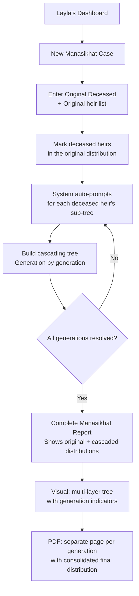

# User Journey Flows

## Journey 1: Sami — The Diaspora Heir

**"Someone passed away. I need answers."**

Sami discovers Mawareeth through Google search ("Islamic inheritance calculator") or a WhatsApp link shared by a relative. He's emotionally charged, non-expert, and on his phone.

**Entry Points:**
- **SEO Landing Page** — Keyword-optimized SSG page with immediate value proposition and "Start Calculation" CTA
- **Shared Link** — A relative sends a Mawareeth report link via WhatsApp; Sami sees the result and starts his own case
- **Direct URL** — Bookmarked or word-of-mouth

```mermaid
flowchart TD
    A[Sami lands on Mawareeth] --> B{Authenticated?}
    B -->|No| C[SEO Landing Page<br/>Value proposition + CTA]
    B -->|Yes| D[Dashboard — My Cases]
    C --> E[Start Calculation — No signup required]
    D --> E2[New Case or Resume Existing]
    E2 -->|New| E
    E2 -->|Resume| F
    E --> F[Guided Interview Begins]
    F --> G[Select Madhab]
    G --> H[Enter Deceased Info<br/>Name, gender, date]
    H --> I[Add Heirs — One at a time<br/>Tree grows in real-time]
    I --> J{More heirs?}
    J -->|Yes| I
    J -->|No| K[Review Family Tree<br/>"Is this complete?"]
    K -->|Edit| I
    K -->|Confirm| L[Calculate — Results Screen]
    L --> M[Full tree + share breakdown<br/>+ fiqh citations]
    M --> N{What next?}
    N --> O[Download Court-Ready PDF]
    N --> P[Share via WhatsApp / Link / Email]
    N --> Q[Save Case — triggers optional signup]
    N --> R[Take to your lawyer<br/>Clear next-step guidance]
```

**Key Design Decisions:**
- Zero friction to first result — no signup wall
- Interview works entirely within the immersive full-screen tree view
- Share via WhatsApp is the primary sharing action (matching user behavior)
- "Save Case" is the conversion moment — optional account creation *after* value delivered
- Clear next-step guidance: "Take this to your lawyer for the Hasr al-Irth filing"

**Error Recovery:**
- Invalid heir combination → gentle fiqh explanation ("A deceased cannot have two fathers — would you like to edit?")
- Network interruption → local state preserved, resume on reconnect
- Accidental browser close → prompt to resume on return (localStorage)

## Journey 2: Layla — The Estate Lawyer

**"I have 10 cases this month. Speed and accuracy are everything."**

Layla is a power user on desktop. She needs a dashboard to manage multiple cases, batch processing, and court-ready output with certification.

```mermaid
flowchart TD
    A[Layla opens Mawareeth] --> B{Authenticated?}
    B -->|No| C[Login / Register<br/>Lawyer verification flow]
    B -->|Yes| D[Dashboard — My Cases]
    C --> D
    D --> E{Action?}
    E -->|New Case| F[Start Guided Interview<br/>Same immersive tree flow]
    E -->|Resume Case| G[Open existing case<br/>Tree loads where she left off]
    E -->|Review Case| H[View completed case<br/>Full results + audit trail]
    F --> I[Guided Interview<br/>Desktop: full tree + floating card]
    G --> I
    I --> J[Complete Interview<br/>Results generated]
    J --> K{Certification?}
    K -->|Review & Certify| L[Lawyer Review Mode<br/>Verify each heir + share]
    K -->|Keep Preliminary| M[Save as Preliminary]
    L --> N[Digital Certification<br/>"Mawareeth-Certified" badge applied]
    N --> O[Generate Certified PDF<br/>Court-ready with fiqh citations]
    M --> O2[Generate Preliminary PDF<br/>Watermarked "Unverified"]
    O --> P[Attach to Court Filing<br/>Export / Print / Share]
    O2 --> P
    H --> Q{Modify?}
    Q -->|Yes| I
    Q -->|No| P
```

**Dashboard Features:**
- **Case list** with status indicators (In Progress, Preliminary, Certified)
- **Quick stats** — cases this month, certified count, time saved
- **Search & filter** by client name, date, status
- **Batch PDF export** for multiple cases

**Key Design Decisions:**
- Dashboard is the home screen for authenticated users
- Same Guided Interview engine as Sami — Layla just moves faster through it
- Certification flow is a separate review step — Layla verifies each heir and share before stamping
- Audit trail visible on every case — who created, who certified, when

**Error Recovery:**
- Case conflict (two lawyers on same family) → notification + merge suggestion
- Certification revocation → clear undo with audit log entry
- Session timeout → auto-save every 30 seconds, resume seamlessly

## Journey 3: Manasikhat — The Multi-Generational Cascade

**"An heir died before the estate was distributed. Their share cascades."**

Manasikhat (المناسخات) is Mawareeth's defining technical capability. It can trigger **within the same interview** when a user marks an heir as deceased, or be accessed as a **dedicated mode** for lawyers handling complex multi-generational cases.

**In-Interview Trigger Flow:**

```mermaid
flowchart TD
    A[During Guided Interview] --> B[User adds an heir]
    B --> C{Is this heir deceased?}
    C -->|No| D[Heir added to tree<br/>Share calculated]
    C -->|Yes| E[Manasikhat Triggered!<br/>Visual indicator on tree node]
    E --> F[Sub-interview opens<br/>"Who are the heirs of this heir?"]
    F --> G[Add sub-heirs<br/>Tree branches expand with animation]
    G --> H{More sub-heirs?}
    H -->|Yes| G
    H -->|No| I{Any sub-heir also deceased?}
    I -->|Yes| J[Recursive cascade<br/>Another sub-interview layer]
    J --> F
    I -->|No| K[Sub-tree complete<br/>Shares recalculated for entire tree]
    K --> L[Return to main interview<br/>All cascaded shares visible]
    D --> M{More heirs to add?}
    L --> M
    M -->|Yes| B
    M -->|No| N[Review Complete Tree<br/>All generations visible]
```

**Dedicated Manasikhat Mode (Lawyer flow):**



**Key Design Decisions:**
- **In-interview trigger** is seamless — marking an heir as deceased naturally opens the sub-tree interview without leaving the main flow
- **Visual distinction** — deceased heirs show a different node style (muted with amber border), their sub-tree branches downward with visual generation indicators
- **Recursive depth** — system handles unlimited generations; tree auto-zooms to accommodate complex graphs
- **Dedicated mode** for lawyers who arrive knowing they have a multi-generational case — starts with the assumption of cascades
- **Dual approach**: same interview naturally handles it, but a dedicated entry point exists for power users

**Error Recovery:**
- Circular reference detection → "This heir cannot also be an ancestor — would you like to review the tree?"
- Overly complex tree → Canvas renderer activates at 20+ nodes with pinch-to-zoom
- Lost in recursion → breadcrumb trail showing "Original → Generation 2 → Generation 3" with click-to-navigate

## Journey Patterns

**Common Patterns Across All Journeys:**

| Pattern | Description | Used In |
|---------|-------------|---------|
| **Progressive Entry** | No signup required → calculate → save triggers account creation | Sami, Layla (first visit) |
| **Immersive Tree Focus** | Full-viewport tree with floating interview card overlay | All journeys |
| **One Question at a Time** | Interview card asks single questions with smart branching | All journeys |
| **Real-Time Share Preview** | Heir pills update live as tree changes | All journeys |
| **Contextual Fiqh Help** | Tooltip with Islamic legal source on any share or validation | All journeys |
| **WhatsApp-First Sharing** | Primary share action matches user behavior | Sami, Layla |
| **Auto-Save & Resume** | State persisted locally, seamless resume | All journeys |

**Navigation Patterns:**
- **Tree-centric navigation** — the family tree is always the reference point; users navigate *through* the tree
- **Floating card pattern** — interview, review, and actions all surface as overlay cards on the tree
- **Breadcrumb depth** — for Manasikhat, breadcrumbs show generation depth within the tree

**Decision Patterns:**
- **Binary branching** — most interview questions are binary (yes/no, male/female) for speed
- **Smart defaults** — Madhab pre-selected based on user's region (editable)
- **Confirmation before commitment** — "Is this your complete family?" before calculating

**Feedback Patterns:**
- **Visual growth** — tree nodes animate into place, confirming each addition
- **Share recalculation ripple** — when shares update, a subtle amber pulse ripples across affected nodes
- **Completion celebration** — subtle, dignified animation when all shares are calculated (not confetti — this is Sharia law)

## Flow Optimization Principles

1. **Minimize Steps to Value** — Sami gets from landing page to complete share distribution in < 5 minutes. No unnecessary screens, no feature tours, no onboarding walls.

2. **Reduce Cognitive Load** — One question per screen. Binary choices where possible. Legal terminology always accompanied by plain-language tooltip. The tree does the explaining — users *see* their family, they don't read about it.

3. **Clear Progress Signals** — Minimal dot stepper shows interview progress. Tree growth itself is a progress indicator — the more complete it looks, the closer you are.

4. **Moments of Delight** — The tree growing is the delight. Each heir node animating into position, connecting to the deceased, showing the relationship — this is the "it understands my family" moment. Restrained, dignified, but emotionally resonant.

5. **Graceful Error Recovery** — Every error is a teaching moment with fiqh context. "This combination isn't possible because..." with an Islamic legal reference. Never a raw error. Always a path forward. The system is the patient scholar, not the strict gatekeeper.

6. **Seamless Manasikhat Escalation** — When a simple case becomes a multi-generational cascade, the transition is invisible. No mode switch, no "advanced mode" toggle. The interview simply asks "Is this heir also deceased?" and the tree grows another layer. Complexity is absorbed, not exposed.
